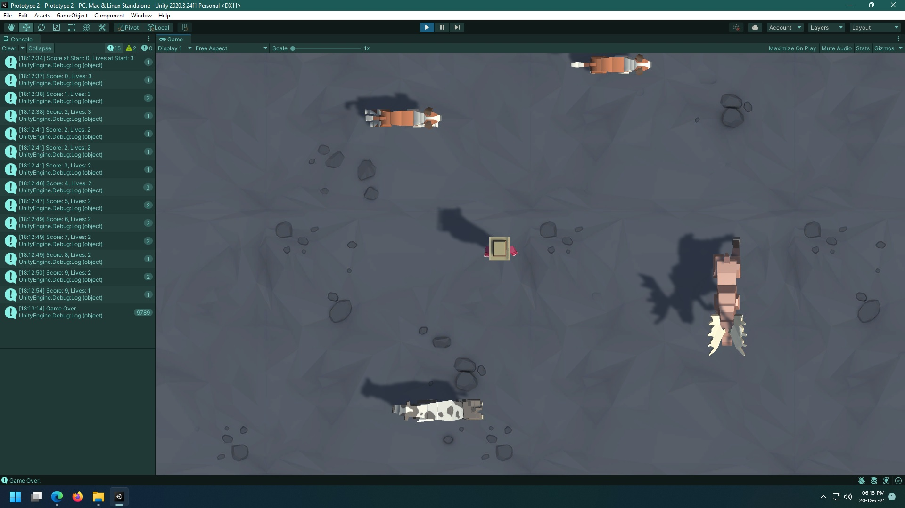

# CWC_Prototype2-Unity
Unity Learn - Junior Programmer: Create with Code 1 - Unit 2: Basic Gameplay.

***main*** branch contains the game created by myself.

***fabricated*** branch contains the game created with help of the solutions.

